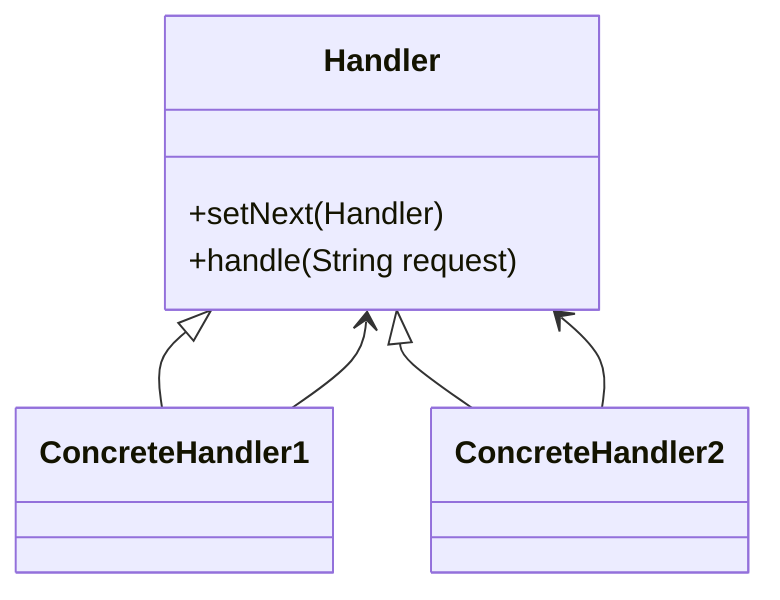

# ⛓️ Chain of Responsibility

**Category:** Behavioral

## 📖 Description

The **Chain of Responsibility** pattern lets you pass requests along a chain of handlers. Each handler decides either to process the request or to pass it to the next handler.

> 🛠️ **Purpose:** Decouple sender and receiver of requests.

---

## 🔧 Structure



---

## 💻 Java 21 Example

### Handler

```java
public interface Handler {
    void setNext(Handler handler);
    void handle(String request);
}
```

### Concrete Handlers

```java
public final class ConcreteHandler1 implements Handler {

    private Handler next;

    @Override
    public void setNext(final Handler handler) {
        this.next = handler;
    }

    @Override
    public void handle(final String request) {
        if ("A".equals(request)) {
            System.out.println("ConcreteHandler1 handled request A");
        } else if (next != null) {
            next.handle(request);
        }
    }
}

public final class ConcreteHandler2 implements Handler {

    private Handler next;

    @Override
    public void setNext(final Handler handler) {
        this.next = handler;
    }

    @Override
    public void handle(final String request) {
        if ("B".equals(request)) {
            System.out.println("ConcreteHandler2 handled request B");
        } else if (next != null) {
            next.handle(request);
        }
    }
}
```

### Usage

```java
public final class Demo {
    public static void main(final String[] args) {
        Handler handler1 = new ConcreteHandler1();
        Handler handler2 = new ConcreteHandler2();
        handler1.setNext(handler2);

        handler1.handle("A");
        handler1.handle("B");
        handler1.handle("C");
    }
}
```
