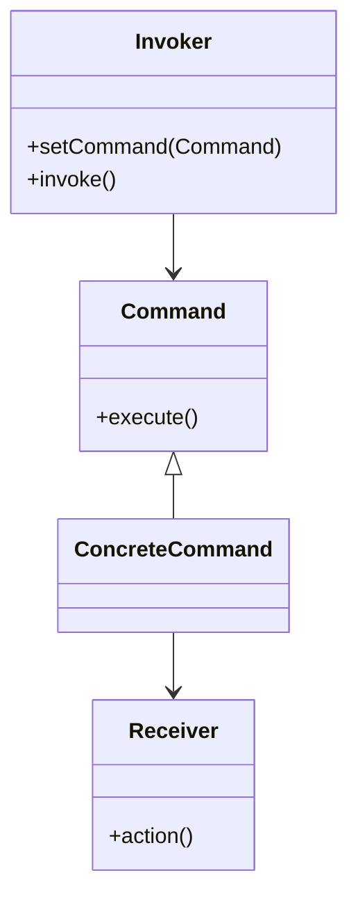

# 📝 Command

**Category:** Behavioral

## 📖 Description

The **Command** pattern encapsulates a request as an object, allowing parameterization of clients with different requests.

> 🛠️ **Purpose:** Decouple sender and receiver of requests.

---

## 🔧 Structure



---

## 💻 Java 21 Example

### Interfaces

```java
public interface Command {
    void execute();
}
```

### Concrete Command & Receiver

```java
public final class Receiver {
    public void action() {
        System.out.println("Receiver: Action performed.");
    }
}

public final class ConcreteCommand implements Command {

    private final Receiver receiver;

    public ConcreteCommand(final Receiver receiver) {
        this.receiver = receiver;
    }

    @Override
    public void execute() {
        receiver.action();
    }
}
```

### Invoker

```java
public final class Invoker {

    private Command command;

    public void setCommand(final Command command) {
        this.command = command;
    }

    public void invoke() {
        command.execute();
    }
}
```

### Usage

```java
public final class Demo {
    public static void main(final String[] args) {
        Receiver receiver = new Receiver();
        Command command = new ConcreteCommand(receiver);
        Invoker invoker = new Invoker();
        invoker.setCommand(command);
        invoker.invoke();
    }
}
```
