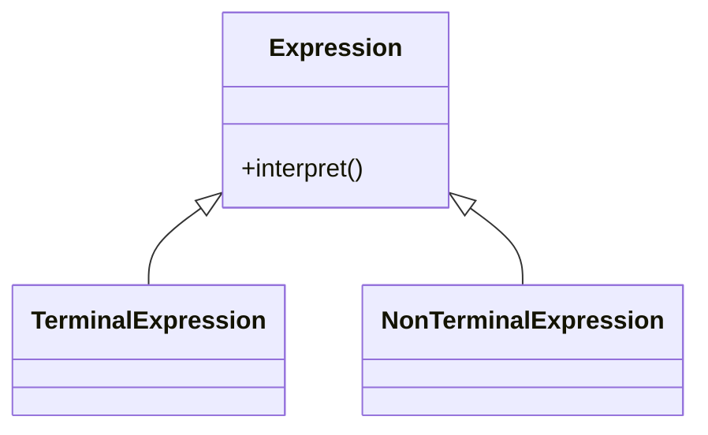

# 🗣️ Interpreter

**Category:** Behavioral

## 📖 Description

The **Interpreter** pattern defines a representation for a grammar and provides an interpreter to process sentences in that grammar.

> 🛠️ **Purpose:** Interpret sentences based on grammar rules.

---

## 🔧 Structure



---

## 💻 Java 21 Example

### Expression

```java
public interface Expression {
    boolean interpret(String context);
}
```

### Terminal Expression

```java
public final class TerminalExpression implements Expression {

    private final String data;

    public TerminalExpression(final String data) {
        this.data = data;
    }

    @Override
    public boolean interpret(final String context) {
        return context.contains(data);
    }
}
```

### Usage

```java
public final class Demo {
    public static void main(final String[] args) {
        Expression isHello = new TerminalExpression("Hello");
        System.out.println(isHello.interpret("Hello World"));
        System.out.println(isHello.interpret("Goodbye World"));
    }
}
```
