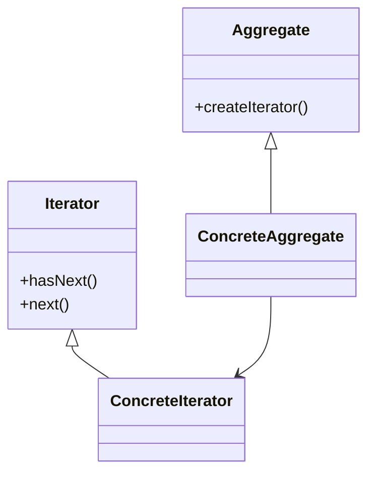

# 🔄 Iterator

**Category:** Behavioral

## 📖 Description

The **Iterator** pattern provides a way to access the elements of an aggregate object sequentially without exposing its internal structure.

> 🛠️ **Purpose:** Traverse collections in a uniform way.

---

## 🔧 Structure



---

## 💻 Java 21 Example

```java
import java.util.List;
import java.util.ArrayList;

public final class NameRepository {

    private final List<String> names = new ArrayList<>();

    public NameRepository() {
        names.add("Alice");
        names.add("Bob");
        names.add("Charlie");
    }

    public Iterator<String> getIterator() {
        return names.iterator();
    }
}
```

### Usage

```java
import java.util.Iterator;

public final class Demo {
    public static void main(final String[] args) {
        NameRepository repository = new NameRepository();
        Iterator<String> it = repository.getIterator();
        while (it.hasNext()) {
            System.out.println(it.next());
        }
    }
}
```
