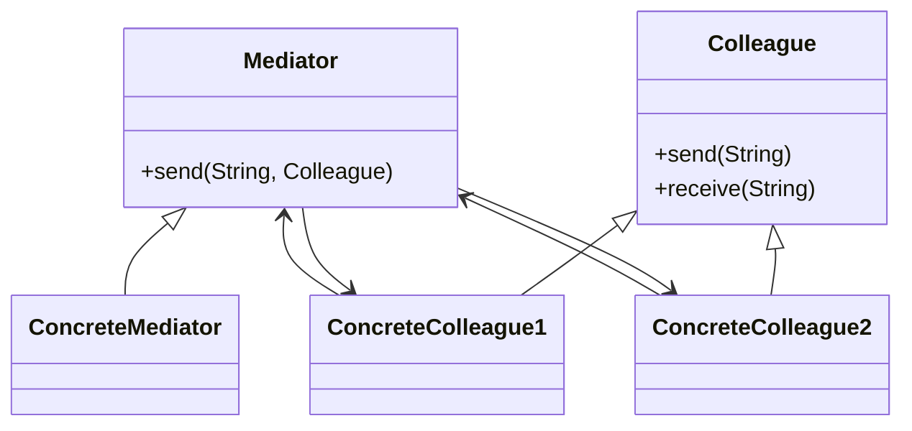

# 🗂️ Mediator

**Category:** Behavioral

## 📖 Description

The **Mediator** pattern defines an object that encapsulates how a set of objects interact, promoting loose coupling.

> 🛠️ **Purpose:** Centralize complex communications.

---

## 🔧 Structure



---

## 💻 Java 21 Example

### Mediator

```java
public interface Mediator {
    void send(String message, Colleague colleague);
}
```

### Colleague

```java
public abstract class Colleague {

    protected Mediator mediator;

    protected Colleague(final Mediator mediator) {
        this.mediator = mediator;
    }

    public abstract void receive(String message);
}
```

### Concrete Mediator

```java
public final class ConcreteMediator implements Mediator {

    private Colleague1 colleague1;
    private Colleague2 colleague2;

    public void setColleague1(final Colleague1 colleague1) {
        this.colleague1 = colleague1;
    }

    public void setColleague2(final Colleague2 colleague2) {
        this.colleague2 = colleague2;
    }

    @Override
    public void send(final String message, final Colleague colleague) {
        if (colleague == colleague1) {
            colleague2.receive(message);
        } else {
            colleague1.receive(message);
        }
    }
}
```

### Concrete Colleagues

```java
public final class Colleague1 extends Colleague {

    public Colleague1(final Mediator mediator) {
        super(mediator);
    }

    @Override
    public void receive(final String message) {
        System.out.println("Colleague1 received: " + message);
    }
}

public final class Colleague2 extends Colleague {

    public Colleague2(final Mediator mediator) {
        super(mediator);
    }

    @Override
    public void receive(final String message) {
        System.out.println("Colleague2 received: " + message);
    }
}
```

### Usage

```java
public final class Demo {
    public static void main(final String[] args) {
        ConcreteMediator mediator = new ConcreteMediator();
        Colleague1 c1 = new Colleague1(mediator);
        Colleague2 c2 = new Colleague2(mediator);

        mediator.setColleague1(c1);
        mediator.setColleague2(c2);

        c1.mediator.send("Hello from C1", c1);
        c2.mediator.send("Hello from C2", c2);
    }
}
```
