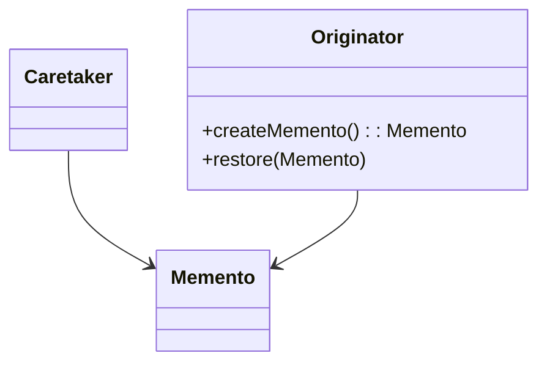

# 🧳 Memento

**Category:** Behavioral

## 📖 Description

The **Memento** pattern captures and externalizes an object's internal state so it can be restored later, without violating encapsulation.

> 🛠️ **Purpose:** Save and restore an object's state.

---

## 🔧 Structure



---

## 💻 Java 21 Example

### Memento

```java
public final class Memento {
    private final String state;

    public Memento(final String state) {
        this.state = state;
    }

    public String getState() {
        return state;
    }
}
```

### Originator

```java
public final class Originator {

    private String state;

    public void setState(final String state) {
        this.state = state;
    }

    public String getState() {
        return state;
    }

    public Memento saveStateToMemento() {
        return new Memento(state);
    }

    public void getStateFromMemento(final Memento memento) {
        state = memento.getState();
    }
}
```

### Caretaker

```java
import java.util.ArrayList;
import java.util.List;

public final class Caretaker {
    private final List<Memento> mementoList = new ArrayList<>();

    public void add(final Memento state) {
        mementoList.add(state);
    }

    public Memento get(final int index) {
        return mementoList.get(index);
    }
}
```

### Usage

```java
public final class Demo {
    public static void main(final String[] args) {
        Originator originator = new Originator();
        Caretaker caretaker = new Caretaker();

        originator.setState("State #1");
        caretaker.add(originator.saveStateToMemento());

        originator.setState("State #2");
        caretaker.add(originator.saveStateToMemento());

        originator.setState("State #3");
        System.out.println("Current: " + originator.getState());

        originator.getStateFromMemento(caretaker.get(0));
        System.out.println("Restored: " + originator.getState());
    }
}
```
