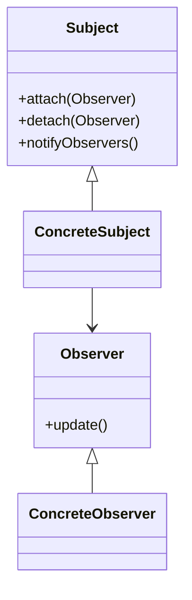

# 👁️ Observer

**Category:** Behavioral

## 📖 Description

The **Observer** pattern defines a one-to-many dependency between objects so that when one object changes state, all its dependents are notified.

> 🛠️ **Purpose:** Notify subscribers about state changes.

---

## 🔧 Structure



---

## 💻 Java 21 Example

### Observer & Subject

```java
public interface Observer {
    void update(String message);
}

public interface Subject {
    void attach(Observer observer);
    void detach(Observer observer);
    void notifyObservers();
}
```

### Concrete Subject

```java
import java.util.ArrayList;
import java.util.List;

public final class ConcreteSubject implements Subject {

    private final List<Observer> observers = new ArrayList<>();
    private String message;

    @Override
    public void attach(final Observer observer) {
        observers.add(observer);
    }

    @Override
    public void detach(final Observer observer) {
        observers.remove(observer);
    }

    public void setMessage(final String message) {
        this.message = message;
        notifyObservers();
    }

    @Override
    public void notifyObservers() {
        for (Observer observer : observers) {
            observer.update(message);
        }
    }
}
```

### Concrete Observer

```java
public final class ConcreteObserver implements Observer {

    private final String name;

    public ConcreteObserver(final String name) {
        this.name = name;
    }

    @Override
    public void update(final String message) {
        System.out.println(name + " received: " + message);
    }
}
```

### Usage

```java
public final class Demo {
    public static void main(final String[] args) {
        ConcreteSubject subject = new ConcreteSubject();
        Observer observer1 = new ConcreteObserver("Observer 1");
        Observer observer2 = new ConcreteObserver("Observer 2");

        subject.attach(observer1);
        subject.attach(observer2);

        subject.setMessage("First message");
        subject.setMessage("Second message");
    }
}
```
