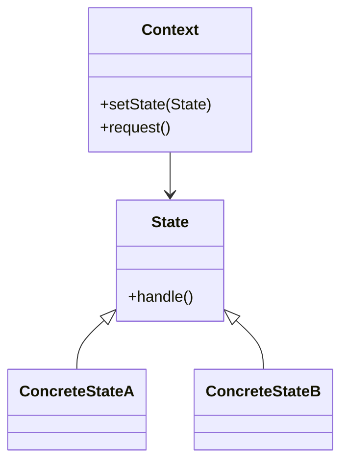

# 🎭 State

**Category:** Behavioral

## 📖 Description

The **State** pattern allows an object to alter its behavior when its internal state changes.

> 🛠️ **Purpose:** Encapsulate state-based behavior.

---

## 🔧 Structure



---

## 💻 Java 21 Example

### State

```java
public interface State {
    void handle();
}
```

### Concrete States

```java
public final class ConcreteStateA implements State {
    @Override
    public void handle() {
        System.out.println("Handling with State A");
    }
}

public final class ConcreteStateB implements State {
    @Override
    public void handle() {
        System.out.println("Handling with State B");
    }
}
```

### Context

```java
public final class Context {

    private State state;

    public void setState(final State state) {
        this.state = state;
    }

    public void request() {
        state.handle();
    }
}
```

### Usage

```java
public final class Demo {
    public static void main(final String[] args) {
        Context context = new Context();
        State stateA = new ConcreteStateA();
        State stateB = new ConcreteStateB();

        context.setState(stateA);
        context.request();

        context.setState(stateB);
        context.request();
    }
}
```
