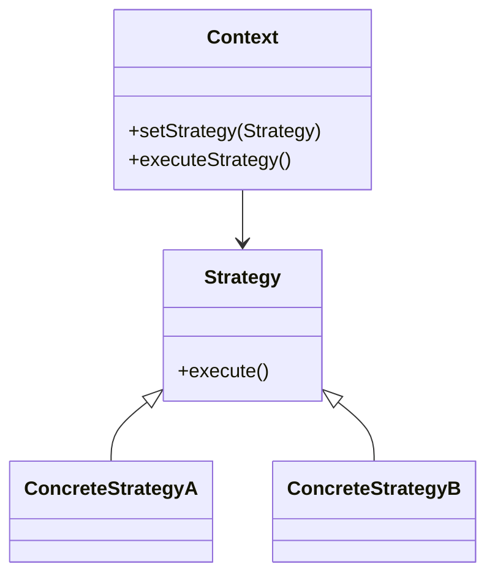

# 🧠 Strategy

**Category:** Behavioral

## 📖 Description

The **Strategy** pattern defines a family of algorithms, encapsulates each one, and makes them interchangeable.

> 🛠️ **Purpose:** Enable switching algorithms at runtime.

---

## 🔧 Structure



---

## 💻 Java 21 Example

### Strategy

```java
public interface Strategy {
    void execute();
}
```

### Concrete Strategies

```java
public final class ConcreteStrategyA implements Strategy {
    @Override
    public void execute() {
        System.out.println("Executing Strategy A");
    }
}

public final class ConcreteStrategyB implements Strategy {
    @Override
    public void execute() {
        System.out.println("Executing Strategy B");
    }
}
```

### Context

```java
public final class Context {

    private Strategy strategy;

    public void setStrategy(final Strategy strategy) {
        this.strategy = strategy;
    }

    public void executeStrategy() {
        strategy.execute();
    }
}
```

### Usage

```java
public final class Demo {
    public static void main(final String[] args) {
        Context context = new Context();

        context.setStrategy(new ConcreteStrategyA());
        context.executeStrategy();

        context.setStrategy(new ConcreteStrategyB());
        context.executeStrategy();
    }
}
```
