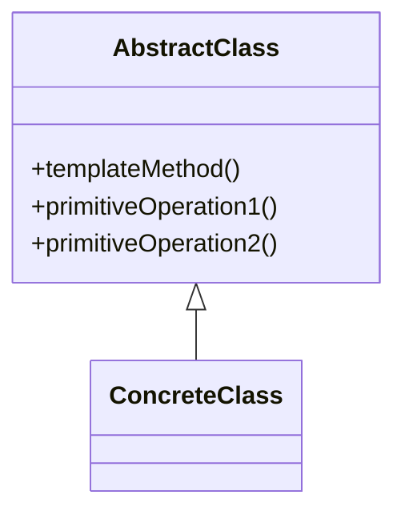

# 📝 Template Method

**Category:** Behavioral

## 📖 Description

The **Template Method** pattern defines the skeleton of an algorithm, deferring some steps to subclasses.

> 🛠️ **Purpose:** Allow subclasses to redefine specific steps of an algorithm.

---

## 🔧 Structure



---

## 💻 Java 21 Example

### Abstract Class

```java
public abstract class AbstractClass {

    public final void templateMethod() {
        primitiveOperation1();
        primitiveOperation2();
    }

    protected abstract void primitiveOperation1();
    protected abstract void primitiveOperation2();
}
```

### Concrete Class

```java
public final class ConcreteClass extends AbstractClass {
    @Override
    protected void primitiveOperation1() {
        System.out.println("Primitive Operation 1");
    }

    @Override
    protected void primitiveOperation2() {
        System.out.println("Primitive Operation 2");
    }
}
```

### Usage

```java
public final class Demo {
    public static void main(final String[] args) {
        AbstractClass obj = new ConcreteClass();
        obj.templateMethod();
    }
}
```
