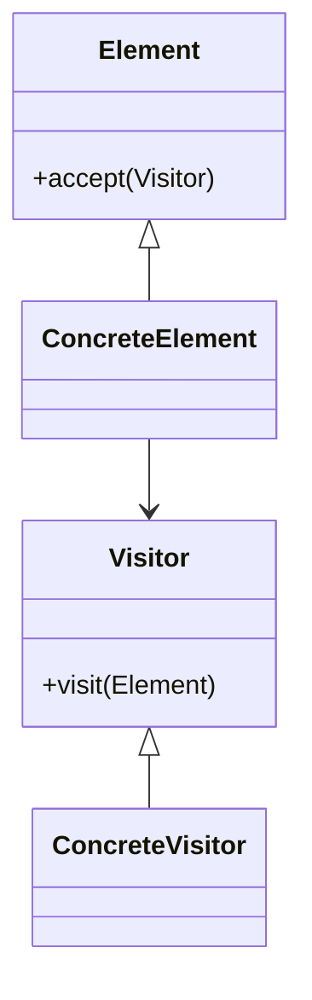

# 👣 Visitor

**Category:** Behavioral

## 📖 Description

The **Visitor** pattern lets you define a new operation without changing the classes of the elements on which it operates.

> 🛠️ **Purpose:** Separate algorithms from the objects on which they operate.

---

## 🔧 Structure



---

## 💻 Java 21 Example

### Visitor & Element

```java
public interface Visitor {
    void visit(ConcreteElement element);
}

public interface Element {
    void accept(Visitor visitor);
}
```

### Concrete Visitor & Element

```java
public final class ConcreteVisitor implements Visitor {
    @Override
    public void visit(final ConcreteElement element) {
        System.out.println("Visited element with data: " + element.getData());
    }
}

public final class ConcreteElement implements Element {

    private final String data;

    public ConcreteElement(final String data) {
        this.data = data;
    }

    public String getData() {
        return data;
    }

    @Override
    public void accept(final Visitor visitor) {
        visitor.visit(this);
    }
}
```

### Usage

```java
public final class Demo {
    public static void main(final String[] args) {
        Element element = new ConcreteElement("Sample Data");
        Visitor visitor = new ConcreteVisitor();
        element.accept(visitor);
    }
}
```
