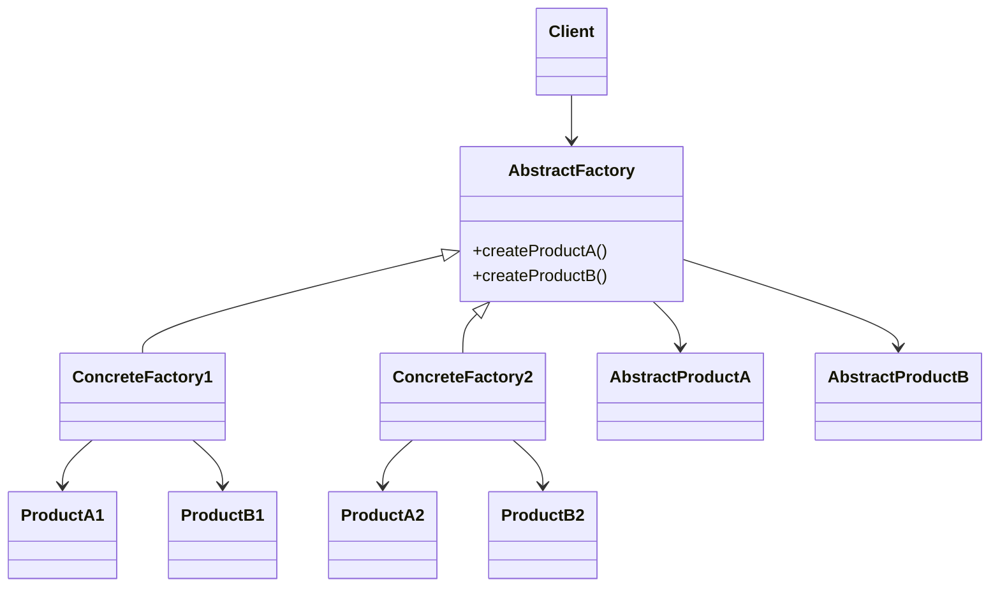

# 🏭 Abstract Factory

**Category:** Creational

## 📖 Description

The **Abstract Factory** pattern provides an interface for creating **families of related or dependent objects** without specifying their concrete classes. It allows you to produce different products that belong to the same family and ensures that the products are compatible with each other.

> 🛠️ **Purpose:** To separate the creation of object families from their usage, making it easy to swap out entire product families.

---

## 🔧 Structure



---

## ✅ Participants

- **AbstractFactory:** Declares interfaces for creating abstract products.
- **ConcreteFactory:** Implements creation methods for concrete products.
- **AbstractProduct:** Declares an interface for a product object.
- **ConcreteProduct:** Implements the abstract product interface.
- **Client:** Works with abstract factories and products only.

---

## 💻 Java 21 Example

### 1️⃣ Interfaces

```java
public interface Button {
    void render();
}

public interface Checkbox {
    void render();
}

public interface GUIFactory {
    Button createButton();
    Checkbox createCheckbox();
}
```

### 2️⃣ Concrete Implementations

```java
// Windows family

public final class WindowsButton implements Button {
    @Override
    public void render() {
        System.out.println("Rendering Windows Button");
    }
}

public final class WindowsCheckbox implements Checkbox {
    @Override
    public void render() {
        System.out.println("Rendering Windows Checkbox");
    }
}

public final class WindowsFactory implements GUIFactory {
    @Override
    public Button createButton() {
        return new WindowsButton();
    }

    @Override
    public Checkbox createCheckbox() {
        return new WindowsCheckbox();
    }
}

// Mac family

public final class MacButton implements Button {
    @Override
    public void render() {
        System.out.println("Rendering Mac Button");
    }
}

public final class MacCheckbox implements Checkbox {
    @Override
    public void render() {
        System.out.println("Rendering Mac Checkbox");
    }
}

public final class MacFactory implements GUIFactory {
    @Override
    public Button createButton() {
        return new MacButton();
    }

    @Override
    public Checkbox createCheckbox() {
        return new MacCheckbox();
    }
}
```

### 3️⃣ Client

```java
public final class Application {

    private final Button button;
    private final Checkbox checkbox;

    public Application(final GUIFactory factory) {
        this.button = factory.createButton();
        this.checkbox = factory.createCheckbox();
    }

    public void renderUI() {
        this.button.render();
        this.checkbox.render();
    }
}
```

### 4️⃣ Usage

```java
public final class Demo {

    public static void main(final String[] args) {
        final GUIFactory factory = getFactoryByOS("Windows");
        final Application app = new Application(factory);
        app.renderUI();
    }

    private static GUIFactory getFactoryByOS(final String osName) {
        return switch (osName) {
            case "Windows" -> new WindowsFactory();
            case "Mac" -> new MacFactory();
            default -> throw new IllegalArgumentException("Unknown OS");
        };
    }
}
```

---

## 🚩 When to Use It

✔ When your code needs to work with various families of related products.  
✔ When you want to enforce that products from the same family are used together.  
✔ When you want to abstract away the instantiation of product families.

---

## ⚖️ Pros & Cons

| ✅ Pros                                                 | ⚠️ Cons                                                     |
|---------------------------------------------------------|-------------------------------------------------------------|
| Isolates the client from concrete classes.              | Can introduce a lot of new classes and complexity.          |
| Ensures product compatibility within the same family.   | Adding new product types can require changes in all factories. |
| Supports the principle of dependency inversion.         |                                                             |
