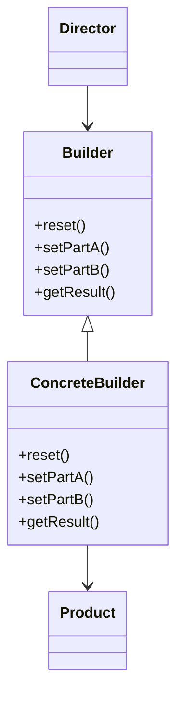

# 🏗️ Builder

**Category:** Creational

## 📖 Description

The **Builder** pattern separates the construction of a complex object from its representation, allowing the same construction process to create different representations. It is particularly useful when you have an object with many optional parameters or complex construction logic.

> 🛠️ **Purpose:** To simplify the creation of complex objects step-by-step, ensuring the object is always in a valid state when complete.

---

## 🔧 Structure



---

## ✅ Participants

- **Builder:** Specifies an abstract interface for creating parts of a Product object.
- **ConcreteBuilder:** Provides specific implementations to build the parts and assemble the product.
- **Director:** Constructs an object using the Builder interface.
- **Product:** The complex object that is being built.

---

## 💻 Java 21 Example

### 1️⃣ Product

```java
public final class House {

    private final String foundation;
    private final String structure;
    private final String roof;

    public House(final String foundation, final String structure, final String roof) {
        this.foundation = foundation;
        this.structure = structure;
        this.roof = roof;
    }

    public void show() {
        System.out.println("House built with: " +
                "Foundation: " + this.foundation +
                ", Structure: " + this.structure +
                ", Roof: " + this.roof);
    }
}
```

### 2️⃣ Builder Interface

```java
public interface HouseBuilder {
    void buildFoundation();
    void buildStructure();
    void buildRoof();
    House getResult();
}
```

### 3️⃣ Concrete Builder

```java
public final class ConcreteHouseBuilder implements HouseBuilder {

    private String foundation;
    private String structure;
    private String roof;

    @Override
    public void buildFoundation() {
        this.foundation = "Concrete Foundation";
    }

    @Override
    public void buildStructure() {
        this.structure = "Concrete Structure";
    }

    @Override
    public void buildRoof() {
        this.roof = "Concrete Roof";
    }

    @Override
    public House getResult() {
        return new House(this.foundation, this.structure, this.roof);
    }
}
```

### 4️⃣ Director

```java
public final class Director {

    private HouseBuilder builder;

    public void setBuilder(final HouseBuilder builder) {
        this.builder = builder;
    }

    public void constructHouse() {
        this.builder.buildFoundation();
        this.builder.buildStructure();
        this.builder.buildRoof();
    }
}
```

### 5️⃣ Usage

```java
public final class Demo {

    public static void main(final String[] args) {
        final Director director = new Director();
        final HouseBuilder builder = new ConcreteHouseBuilder();

        director.setBuilder(builder);
        director.constructHouse();

        final House house = builder.getResult();
        house.show();
    }
}
```

---

## 🚩 When to Use It

✔ When you need to construct a complex object step by step.  
✔ When the construction process must allow different representations of the object.  
✔ When you want to avoid telescoping constructors (constructors with many parameters).

---

## ⚖️ Pros & Cons

| ✅ Pros                                               | ⚠️ Cons                                                   |
|-------------------------------------------------------|-----------------------------------------------------------|
| Allows step-by-step construction.                     | Requires multiple classes.                                |
| Can reuse the same construction code for different products. | Might be overkill for simple objects.                      |
| Improves readability and maintainability for complex objects. |                                                           |
