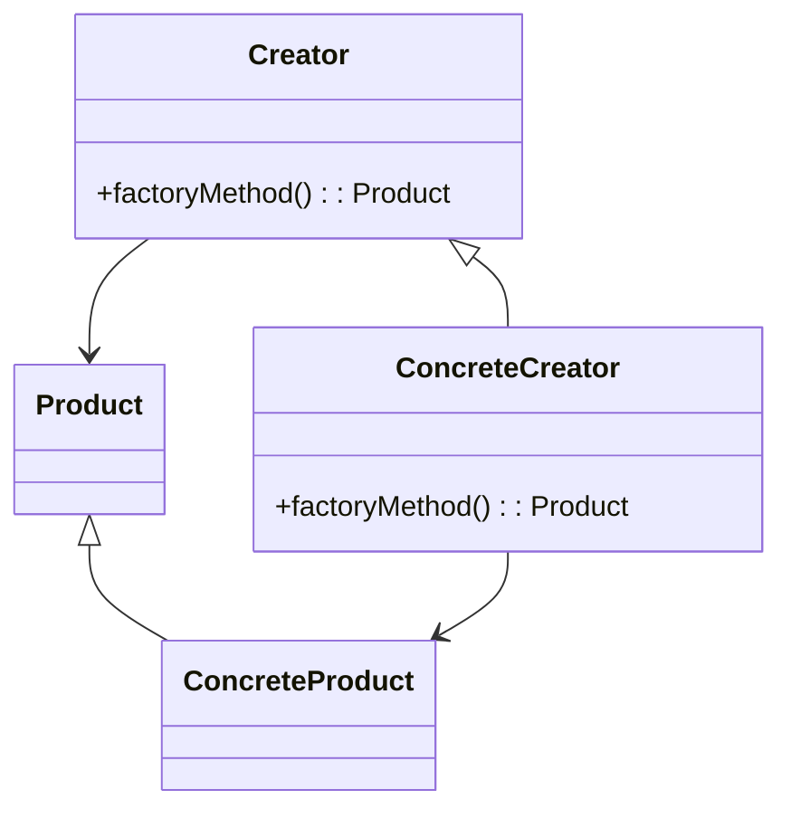

# 🏭 Factory Method

**Category:** Creational

## 📖 Description

The **Factory Method** defines an interface for creating an object, but allows subclasses to alter the type of objects that will be created.

> 🛠️ **Purpose:** To delegate the instantiation logic to subclasses.

---

## 🔧 Structure



---

## 💻 Java 21 Example

### Interfaces

```java
public interface Product {
    void use();
}

public abstract class Creator {
    public abstract Product factoryMethod();
}
```

### Concrete

```java
public final class ConcreteProduct implements Product {
    @Override
    public void use() {
        System.out.println("Using ConcreteProduct");
    }
}

public final class ConcreteCreator extends Creator {
    @Override
    public Product factoryMethod() {
        return new ConcreteProduct();
    }
}
```

### Usage

```java
public final class Demo {
    public static void main(final String[] args) {
        Creator creator = new ConcreteCreator();
        Product product = creator.factoryMethod();
        product.use();
    }
}
```
