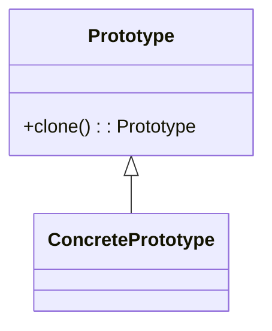

# 🌀 Prototype

**Category:** Creational

## 📖 Description

The **Prototype** pattern allows you to create new objects by copying an existing object (the prototype).

> 🛠️ **Purpose:** To avoid the overhead of creating complex objects from scratch.

---

## 🔧 Structure



---

## 💻 Java 21 Example

### Prototype Interface

```java
public interface Prototype {
    Prototype clone();
}
```

### Concrete Prototype

```java
public final class ConcretePrototype implements Prototype {

    private final String data;

    public ConcretePrototype(final String data) {
        this.data = data;
    }

    @Override
    public Prototype clone() {
        return new ConcretePrototype(this.data);
    }

    public void show() {
        System.out.println("Data: " + this.data);
    }
}
```

### Usage

```java
public final class Demo {
    public static void main(final String[] args) {
        ConcretePrototype prototype = new ConcretePrototype("Sample");
        ConcretePrototype clone = (ConcretePrototype) prototype.clone();
        clone.show();
    }
}
```
