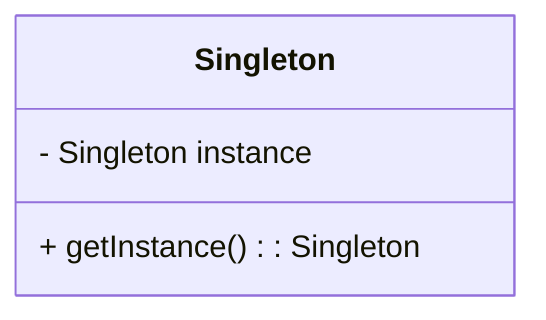

# 🔒 Singleton

**Category:** Creational

## 📖 Description

The **Singleton** pattern ensures that a class has only one instance and provides a global point of access to it.

> 🛠️ **Purpose:** Control access to a sole instance.

---

## 🔧 Structure



---

## 💻 Java 21 Example

```java
public final class Singleton {

    private static Singleton instance;

    private Singleton() {
        // private constructor
    }

    public static Singleton getInstance() {
        if (instance == null) {
            instance = new Singleton();
        }
        return instance;
    }

    public void showMessage() {
        System.out.println("Hello from Singleton!");
    }
}
```

### Usage

```java
public final class Demo {
    public static void main(final String[] args) {
        Singleton singleton = Singleton.getInstance();
        singleton.showMessage();
    }
}
```
