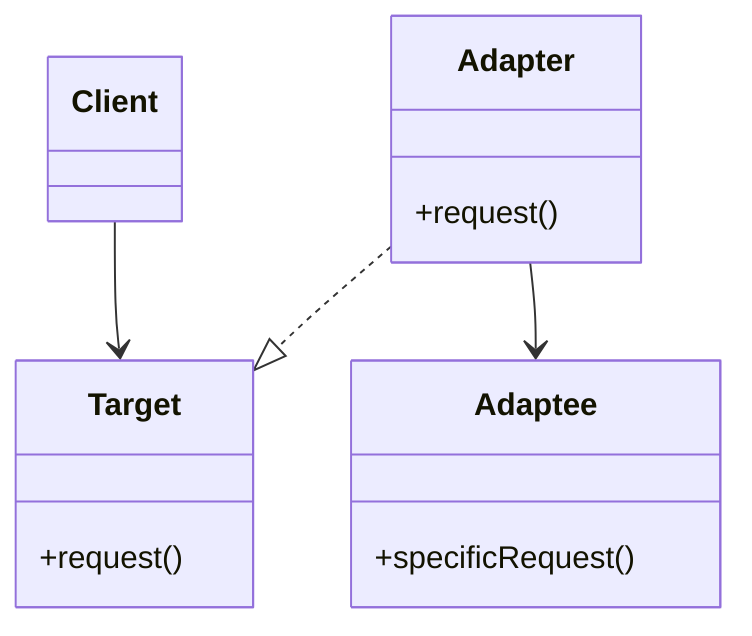

# 🔌 Adapter

**Category:** Structural

## 📖 Description

The **Adapter** pattern allows incompatible interfaces to work together by converting one interface into another that a client expects.

> 🛠️ **Purpose:** Enable classes with incompatible interfaces to collaborate.

---

## 🔧 Structure



---

## 💻 Java 21 Example

### Interfaces

```java
public interface Target {
    void request();
}

public final class Adaptee {
    public void specificRequest() {
        System.out.println("Called specificRequest");
    }
}
```

### Adapter

```java
public final class Adapter implements Target {

    private final Adaptee adaptee;

    public Adapter(final Adaptee adaptee) {
        this.adaptee = adaptee;
    }

    @Override
    public void request() {
        adaptee.specificRequest();
    }
}
```

### Usage

```java
public final class Demo {
    public static void main(final String[] args) {
        Adaptee adaptee = new Adaptee();
        Target target = new Adapter(adaptee);
        target.request();
    }
}
```
