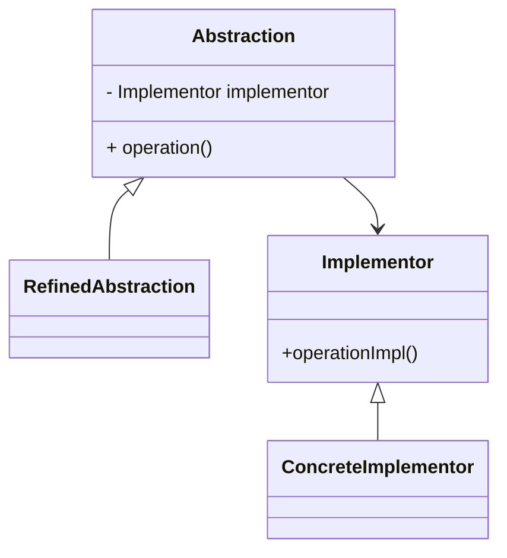

# 🌉 Bridge

**Category:** Structural

## 📖 Description

The **Bridge** pattern separates an abstraction from its implementation so that the two can vary independently.

> 🛠️ **Purpose:** Decouple abstraction and implementation.

---

## 🔧 Structure



---

## 💻 Java 21 Example

### Interfaces

```java
public interface Implementor {
    void operationImpl();
}

public abstract class Abstraction {
    protected final Implementor implementor;

    protected Abstraction(final Implementor implementor) {
        this.implementor = implementor;
    }

    public abstract void operation();
}
```

### Concrete

```java
public final class ConcreteImplementor implements Implementor {
    @Override
    public void operationImpl() {
        System.out.println("Concrete implementation");
    }
}

public final class RefinedAbstraction extends Abstraction {

    public RefinedAbstraction(final Implementor implementor) {
        super(implementor);
    }

    @Override
    public void operation() {
        implementor.operationImpl();
    }
}
```

### Usage

```java
public final class Demo {
    public static void main(final String[] args) {
        Implementor implementor = new ConcreteImplementor();
        Abstraction abstraction = new RefinedAbstraction(implementor);
        abstraction.operation();
    }
}
```
