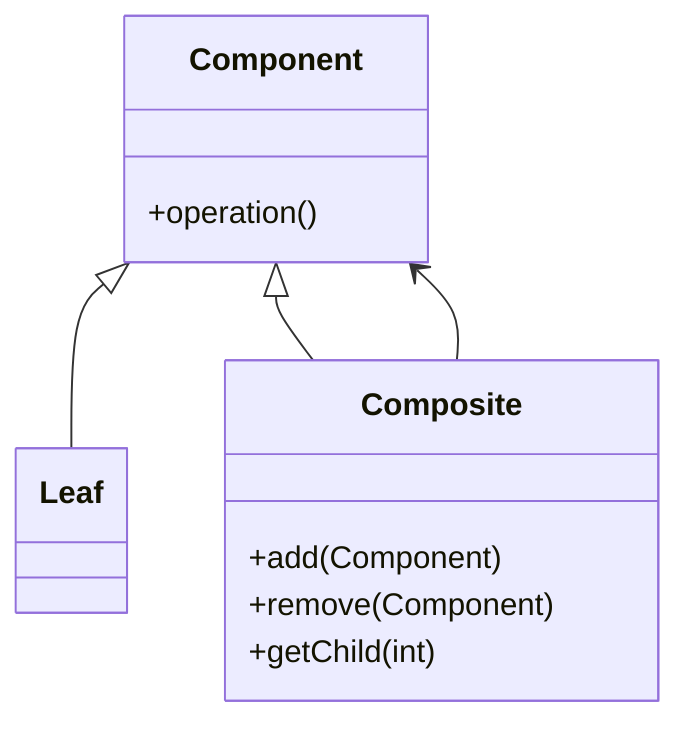

# 🌳 Composite

**Category:** Structural

## 📖 Description

The **Composite** pattern composes objects into tree structures to represent part-whole hierarchies. It lets clients treat individual objects and compositions uniformly.

> 🛠️ **Purpose:** Simplify client code by treating objects and groups of objects the same way.

---

## 🔧 Structure



---

## 💻 Java 21 Example

### Component

```java
public interface Component {
    void operation();
}
```

### Leaf

```java
public final class Leaf implements Component {
    @Override
    public void operation() {
        System.out.println("Leaf operation");
    }
}
```

### Composite

```java
import java.util.ArrayList;
import java.util.List;

public final class Composite implements Component {

    private final List<Component> children = new ArrayList<>();

    public void add(final Component component) {
        children.add(component);
    }

    @Override
    public void operation() {
        for (Component child : children) {
            child.operation();
        }
    }
}
```

### Usage

```java
public final class Demo {
    public static void main(final String[] args) {
        Leaf leaf1 = new Leaf();
        Leaf leaf2 = new Leaf();
        Composite composite = new Composite();
        composite.add(leaf1);
        composite.add(leaf2);
        composite.operation();
    }
}
```
