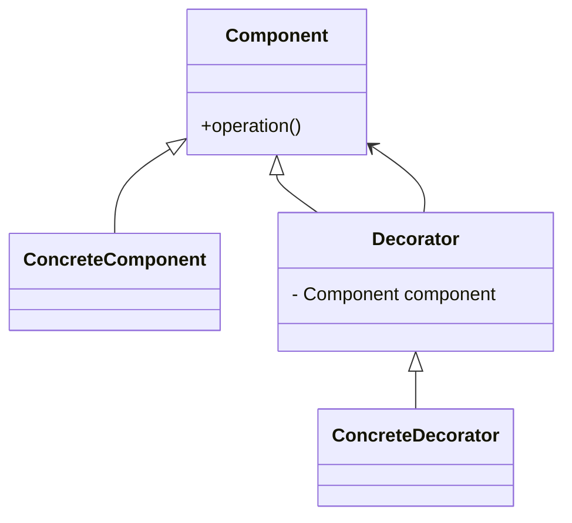

# 🎨 Decorator

**Category:** Structural

## 📖 Description

The **Decorator** pattern dynamically adds responsibilities to objects without modifying their code.

> 🛠️ **Purpose:** Extend behavior of objects dynamically.

---

## 🔧 Structure



---

## 💻 Java 21 Example

### Component

```java
public interface Component {
    void operation();
}
```

### Concrete Component

```java
public final class ConcreteComponent implements Component {
    @Override
    public void operation() {
        System.out.println("ConcreteComponent operation");
    }
}
```

### Decorator

```java
public abstract class Decorator implements Component {

    protected final Component component;

    protected Decorator(final Component component) {
        this.component = component;
    }

    @Override
    public void operation() {
        component.operation();
    }
}
```

### Concrete Decorator

```java
public final class ConcreteDecorator extends Decorator {

    public ConcreteDecorator(final Component component) {
        super(component);
    }

    @Override
    public void operation() {
        super.operation();
        addedBehavior();
    }

    private void addedBehavior() {
        System.out.println("Added behavior");
    }
}
```

### Usage

```java
public final class Demo {
    public static void main(final String[] args) {
        Component component = new ConcreteComponent();
        Component decorated = new ConcreteDecorator(component);
        decorated.operation();
    }
}
```
