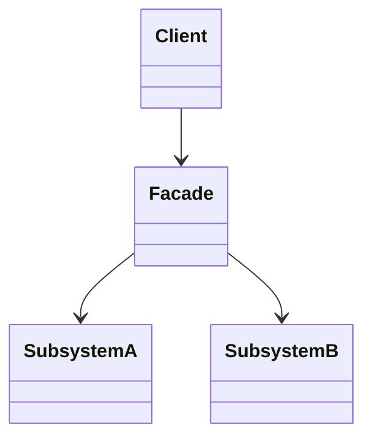

# 🏢 Facade

**Category:** Structural

## 📖 Description

The **Facade** pattern provides a simplified interface to a larger body of code, such as a complex subsystem.

> 🛠️ **Purpose:** Simplify the use of complex subsystems.

---

## 🔧 Structure



---

## 💻 Java 21 Example

### Subsystems

```java
public final class SubsystemA {
    public void operationA() {
        System.out.println("SubsystemA operation");
    }
}

public final class SubsystemB {
    public void operationB() {
        System.out.println("SubsystemB operation");
    }
}
```

### Facade

```java
public final class Facade {

    private final SubsystemA subsystemA = new SubsystemA();
    private final SubsystemB subsystemB = new SubsystemB();

    public void operation() {
        subsystemA.operationA();
        subsystemB.operationB();
    }
}
```

### Usage

```java
public final class Demo {
    public static void main(final String[] args) {
        Facade facade = new Facade();
        facade.operation();
    }
}
```
