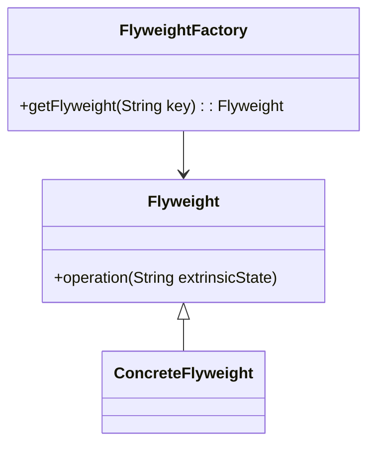

# 🪶 Flyweight

**Category:** Structural

## 📖 Description

The **Flyweight** pattern reduces memory usage by sharing as much data as possible with similar objects.

> 🛠️ **Purpose:** Optimize memory use when many objects share common data.

---

## 🔧 Structure



---

## 💻 Java 21 Example

### Flyweight Interface

```java
public interface Flyweight {
    void operation(String extrinsicState);
}
```

### Concrete Flyweight

```java
public final class ConcreteFlyweight implements Flyweight {

    private final String intrinsicState;

    public ConcreteFlyweight(final String intrinsicState) {
        this.intrinsicState = intrinsicState;
    }

    @Override
    public void operation(final String extrinsicState) {
        System.out.println("Intrinsic: " + intrinsicState + ", Extrinsic: " + extrinsicState);
    }
}
```

### Flyweight Factory

```java
import java.util.HashMap;
import java.util.Map;

public final class FlyweightFactory {

    private final Map<String, Flyweight> flyweights = new HashMap<>();

    public Flyweight getFlyweight(final String key) {
        return flyweights.computeIfAbsent(key, k -> new ConcreteFlyweight(k));
    }
}
```

### Usage

```java
public final class Demo {
    public static void main(final String[] args) {
        FlyweightFactory factory = new FlyweightFactory();
        Flyweight flyweight1 = factory.getFlyweight("A");
        Flyweight flyweight2 = factory.getFlyweight("A");
        flyweight1.operation("First call");
        flyweight2.operation("Second call");
    }
}
```
