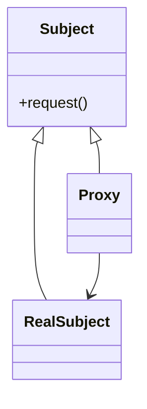

# 🛡️ Proxy

**Category:** Structural

## 📖 Description

The **Proxy** pattern provides a surrogate or placeholder for another object to control access to it.

> 🛠️ **Purpose:** Control access, add security, caching, or lazy instantiation.

---

## 🔧 Structure



---

## 💻 Java 21 Example

### Interfaces

```java
public interface Subject {
    void request();
}
```

### Real Subject

```java
public final class RealSubject implements Subject {
    @Override
    public void request() {
        System.out.println("RealSubject: Handling request.");
    }
}
```

### Proxy

```java
public final class Proxy implements Subject {

    private RealSubject realSubject;

    @Override
    public void request() {
        if (realSubject == null) {
            realSubject = new RealSubject();
        }
        System.out.println("Proxy: Logging before request.");
        realSubject.request();
    }
}
```

### Usage

```java
public final class Demo {
    public static void main(final String[] args) {
        Subject proxy = new Proxy();
        proxy.request();
    }
}
```
